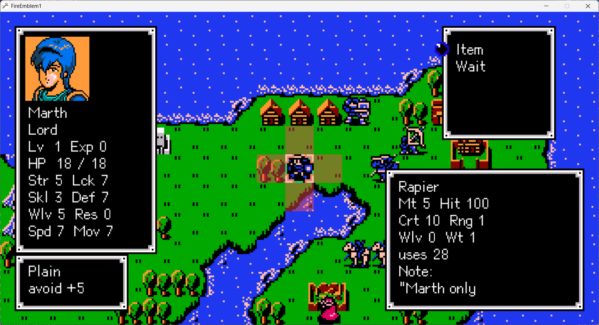
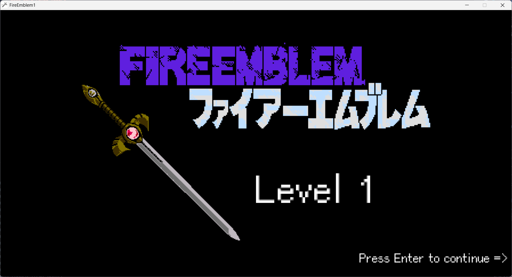

# 2025 OOPL Final Report

## 一、組別資訊
組別：26

組員：112820022周佩樺、112590022陳駿逸

復刻遊戲：FE1 (Fire Emblem1) PC version

## 二、專案簡介

### 遊戲簡介

[Fire Emblem: Shadow Dragon and the Blade of Light (FE1)](https://serenesforest.net/shadow-dragon-and-blade-of-light/) 是 Fire Emblem 系列的第一部作品，屬於戰略角色扮演（SRPG）遊戲，由任天堂於1990年在FC紅白機上發行。
結合戰略遊戲的遊玩方式與角色扮演遊戲的劇情推演及人物成長，務求營造出昔日戰略遊戲中不存在的角色親近感。系列遊戲的每場戰鬥都在網格狀地圖上進行，戰鬥系統採用回合制，以我方、敵方、友方的排序進行回合交替，玩家可在故事主線和支線任務中控制一定數量角色。每個角色都有特定職業，它決定了角色的能力值並影響他們的攻擊範圍、移動距離等。部分職業具備獨有的先天技能，而角色的能力值及其升幅也各有不同。

### 組別分工
112820022周佩樺：素材處理、資訊UI製作、升級UI製作、測試  
112590022陳駿逸：物件建置、武器管理、流程處理

## 三、遊戲介紹

### 遊戲規則
Marth是主角，遊戲目標是讓Marth到達城堡完成兩個關卡，而一旦HP歸零則敗北。
每位角色有職業、基礎數值、成長率、4個背包欄位，角色可以選擇背包裡的其中一個欄位作為手持欄位，而每個武器有基礎數值、攻擊距離。考慮大部分的玩家行為都是根據選擇來達成目的，因此之後的說明皆採用以下線性的狀態與流程來撰寫：

1. [⬆️⬇️➡️⬅️]：控制選擇框移動到對想操作的角色座標
2. [ENTER↩️]：選取該角色，該角色進入走路狀態
   - 藍色的tips是可行走的範圍（[職業地形成本對應表](class_cost.png)）
   - 紅色的tips是可攻擊最大範圍（根據角色背包所有武器）

3. [⬆️⬇️➡️⬅️]：控制選擇框移動到想讓角色移動到的座標（受限在藍色tips的範圍中）
4. 該角色移動到該座標（紅色tips表示當前可攻擊範圍）
5. 顯示當前角色可以做的所有動作（ActUI）
   - [⬆️⬇️]：操控選擇點移動
   - 5-1. [ENTER↩️] Next 選項：Marth到該關卡的城堡後出現，選擇進入下一關
   - 5-2. [ENTER↩️] Visit 選項：到特定村莊拜訪獲得錢錢、拜訪獲得Wry角色
   - 5-3. [ENTER↩️] Talk 選項：當Marth遇到敵人Darros、Caeda遇到敵人Castor可以將其變成我方角色
   - 5-4. [ENTER↩️] Armory 選項：當角色在商店時出現，選擇進入商店頁面（ShopUI）
     - [⬆️⬇️]：操控選擇點移動（可買的當前角色職業武器，若無則不會出現選擇點）
     - [ENTER↩️]：購買物品
     - [BACKSPACE↪️]：結束該回合該角色的行動
  
   - 5-5. [ENTER↩️] Attack 選項：當敵人在角色攻擊範圍內時出現，選擇進行敵人的選取
     - [⬆️⬇️➡️⬅️]：控制選擇框到要攻擊的敵人
     - 5-5-1. [ENTER↩️]：進入武器頁面（WeaponUI）
       - [⬆️⬇️]：操控選擇點移動
       - [ENTER↩️]：選取手持的攻擊武器
  
   - 5-6. [ENTER↩️] Target 選項：當隊友在角色有效範圍內時出現，選擇進行隊友的選取
     - 5-6-1. [ENTER↩️]：進入武器頁面（WeaponUI）
       - [⬆️⬇️]：操控選擇點移動
       - [ENTER↩️]：選取手持的Heal

   - 5-7. [ENTER↩️] Item 選項：進入背包頁面（ItemUI）
     - [⬆️⬇️]：操控選擇點移動
     - [ENTER↩️]：選取手持物品並回到ActUI
     - [SPACE⏹️]：捨棄物品

   - 5-8. [ENTER↩️] Wait 選項：結束該回合該角色的行動
6. 當所有我方角色移動完後換敵人回合行動
7. 敵人優先攻擊Marth或是血量較少者

[F1] : 顯示/隱藏 地形資訊（TileInfoUI） 
[F2] : 顯示/隱藏 角色詳情資訊（CharacterInfoFullUI） 
[F3] : 顯示/隱藏 角色武器資訊（ItemInfoUI），[Q]可以換下一把武器 
[F4] : 顯示/隱藏 角色移動提示（Tips in PlayerManager） 

[0️⃣]：結束玩家移動回合  
[1️⃣]：開/關 敵人的移動（作弊鍵） 

---

攻擊規則： 
攻擊角色的武器如果對被攻擊角色的職業克制則享有三被傷害，攻擊角色有機率觸發爆擊，被攻擊的角色有機率觸發閃避。假設A角色先攻擊B角色，接著B角色可以根據手持的武器進行反擊，若A的行動速度（速度值-武器重量）比B快，A可獲得一次追擊，反之，若B的行動速度比A快，B可獲得一次追擊。

經驗與升級規則： 

### 遊戲畫面

## 四、程式設計

### 程式架構
### 程式技術

## 五、結語

### 問題與解決方法
### 自評

| 項次 | 項目                   | 完成 |
|------|------------------------|-------|
| 1    | 這是範例 |  V  |
| 2    | 完成專案權限改為 public |    |
| 3    | 具有 debug mode 的功能  |    |
| 4    | 解決專案上所有 Memory Leak 的問題  |    |
| 5    | 報告中沒有任何錯字，以及沒有任何一項遺漏  |    |
| 6    | 報告至少保持基本的美感，人類可讀  |    |

### 心得
### 貢獻比例