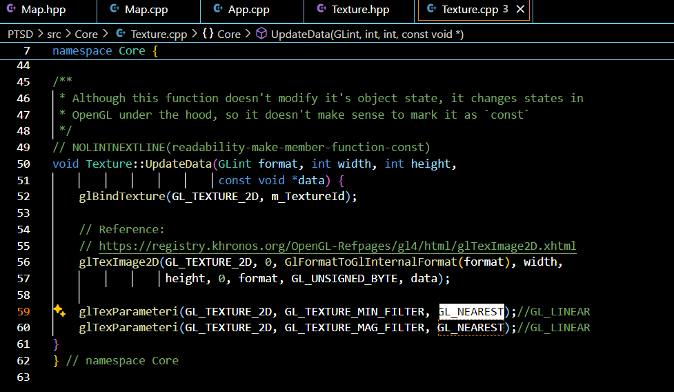

# PTSD Template

This is a [PTSD](https://github.com/ntut-open-source-club/practical-tools-for-simple-design) framework template for students taking OOPL2024s.([PTSD README](https://github.com/ntut-open-source-club/practical-tools-for-simple-design))

```sh
cmake -DCMAKE_BUILD_TYPE=Debug -B build -G Ninja
```

<BR>
 
## You can make some changes to make it better

